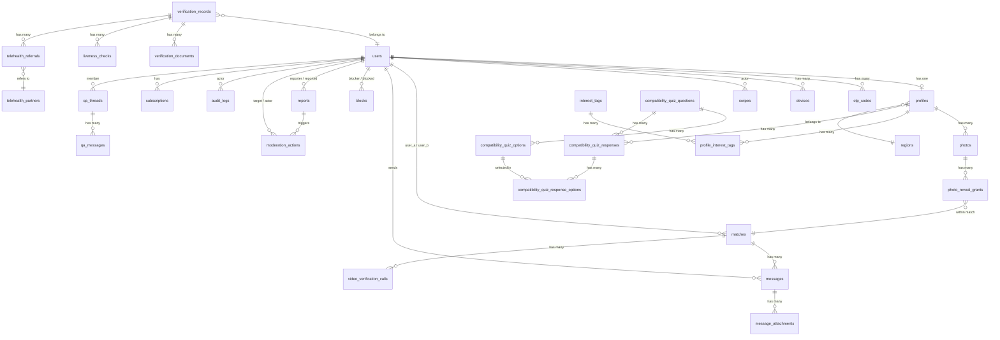

# Lib le Lib — Database Schema Documentation

> **PostgreSQL 14+** · Generated from `lib-le-lib-schema.sql`
> Maps to Build Documentation Sections 4 (Features), 5.1 (Data Model), 5.2 (Privacy & Security)

---

## Table of Contents

1. [Design Principles](#design-principles)
2. [Architecture Overview](#architecture-overview)
3. [Enum Types](#enum-types)
4. [Schema: `public`](#schema-public)
   - [Core Identity](#core-identity)
   - [Profile](#profile)
   - [Photos & Visibility](#photos--visibility)
   - [Discovery & Matching](#discovery--matching)
   - [Messaging](#messaging)
   - [Safety & Trust](#safety--trust)
   - [Support & Wellbeing](#support--wellbeing)
   - [Monetization](#monetization)
5. [Schema: `verification`](#schema-verification)
6. [Triggers & Functions](#triggers--functions)
7. [Entity Relationship Diagram](#entity-relationship-diagram)
8. [Full SQL Source](#full-sql-source)

---

## Design Principles

These six principles are enforced at the database level and carried over from the build documentation:

| # | Principle | Enforcement |
|---|-----------|-------------|
| 1 | **Verification data isolation** | Separate `verification` schema with role-gated access |
| 2 | **No legal names stored** | `profiles.nickname` only — no `first_name`/`last_name` columns exist |
| 3 | **No exact GPS coordinates** | `regions` table stores city/region name only |
| 4 | **Photos blurred by default** | `photos.blurred_default = true`; reveal requires explicit `photo_reveal_grants` row |
| 5 | **End-to-end encrypted chat** | `messages.ciphertext` (BYTEA) + `nonce` — server never sees plaintext |
| 6 | **Full audit logging** | `audit_logs` table — append-only for every verification/moderation decision |

---

## Architecture Overview

The database uses **two PostgreSQL schemas**:

- **`public`** — All application data (users, profiles, matches, messages, etc.)
- **`verification`** — Isolated verification data (documents, liveness checks, telehealth referrals) with short retention and role-gated access

**Extension required:** `pgcrypto` (for `gen_random_uuid()`)

---

## Enum Types

### User & Auth

| Enum | Values |
|------|--------|
| `user_status` | `pending_verification`, `active`, `suspended`, `banned`, `deleted` |
| `user_role` | `member`, `verification_officer`, `moderator`, `admin`, `health_professional` |

### Profile

| Enum | Values |
|------|--------|
| `gender_type` | `man`, `woman`, `other` |
| `relationship_goal` | `marriage`, `serious_relationship`, `friendship` |
| `language_code` | `am`, `en` |

### Verification

| Enum | Values |
|------|--------|
| `verification_status` | `submitted`, `in_review`, `approved`, `rejected`, `expired` |
| `verification_method` | `self_upload`, `telehealth` |
| `liveness_result` | `pass`, `fail`, `manual_review` |

### Discovery & Matching

| Enum | Values |
|------|--------|
| `swipe_action` | `like`, `pass` |
| `match_status` | `active`, `unmatched` |
| `quiz_question_type` | `single_choice`, `multi_choice`, `scale`, `free_text` |

### Messaging

| Enum | Values |
|------|--------|
| `message_type` | `text`, `image` |
| `video_call_status` | `scheduled`, `completed`, `canceled` |

### Safety & Trust

| Enum | Values |
|------|--------|
| `report_category` | `harassment`, `fake_profile`, `outing_threat`, `solicitation`, `scam`, `underage_suspicion`, `other` |
| `report_status` | `open`, `investigating`, `resolved`, `dismissed` |
| `report_severity` | `low`, `medium`, `high`, `critical` |
| `moderation_action_type` | `warn`, `suspend`, `ban`, `request_resubmission`, `none` |

### Support & Wellbeing

| Enum | Values |
|------|--------|
| `resource_category` | `treatment_info`, `u_equals_u`, `hotline`, `general` |
| `qa_thread_status` | `open`, `answered`, `closed` |

### Monetization

| Enum | Values |
|------|--------|
| `subscription_plan` | `free`, `premium` |
| `subscription_status` | `active`, `canceled`, `expired`, `past_due` |

---

## Schema: `public`

### Core Identity

#### `users`
> Core auth identity. No legal name field by design (doc 4.2).

| Column | Type | Constraints | Notes |
|--------|------|-------------|-------|
| `id` | UUID | PK, default `gen_random_uuid()` | |
| `phone` | TEXT | UNIQUE, nullable | |
| `email` | TEXT | UNIQUE, nullable | |
| `password_hash` | TEXT | nullable | OTP-only auth supported |
| `role` | `user_role` | NOT NULL, default `'member'` | |
| `status` | `user_status` | NOT NULL, default `'pending_verification'` | |
| `created_at` | TIMESTAMPTZ | NOT NULL, default `now()` | |
| `updated_at` | TIMESTAMPTZ | NOT NULL, default `now()` | Auto-updated via trigger |
| `last_login_at` | TIMESTAMPTZ | nullable | |

**Constraints:** `chk_users_has_contact` — at least one of `phone` or `email` must be non-null.
**Triggers:** `trg_users_updated_at` — auto-sets `updated_at` on update.

---

#### `otp_codes`

| Column | Type | Constraints | Notes |
|--------|------|-------------|-------|
| `id` | UUID | PK | |
| `destination` | TEXT | NOT NULL | Phone or email being verified |
| `code_hash` | TEXT | NOT NULL | |
| `user_id` | UUID | FK → `users.id` ON DELETE CASCADE | |
| `attempts` | SMALLINT | NOT NULL, default 0 | |
| `expires_at` | TIMESTAMPTZ | NOT NULL | |
| `consumed_at` | TIMESTAMPTZ | nullable | |
| `created_at` | TIMESTAMPTZ | NOT NULL, default `now()` | |

**Indexes:** `idx_otp_codes_destination` on `destination`.

---

#### `devices`

| Column | Type | Constraints | Notes |
|--------|------|-------------|-------|
| `id` | UUID | PK | |
| `user_id` | UUID | NOT NULL, FK → `users.id` ON DELETE CASCADE | |
| `push_token` | TEXT | nullable | |
| `platform` | TEXT | NOT NULL | `'ios'` or `'android'` |
| `public_key` | TEXT | nullable | E2E key-exchange public key |
| `created_at` | TIMESTAMPTZ | NOT NULL, default `now()` | |
| `last_seen_at` | TIMESTAMPTZ | NOT NULL, default `now()` | |

**Indexes:** `idx_devices_user_id` on `user_id`.

---

### Profile

#### `regions`

| Column | Type | Constraints | Notes |
|--------|------|-------------|-------|
| `id` | UUID | PK | |
| `country_code` | TEXT | NOT NULL | ISO 3166-1 alpha-2 (e.g. `'ET'`) |
| `name` | TEXT | NOT NULL | City/region display name — never exact coordinates |

---

#### `profiles`

| Column | Type | Constraints | Notes |
|--------|------|-------------|-------|
| `user_id` | UUID | PK, FK → `users.id` ON DELETE CASCADE | |
| `nickname` | TEXT | NOT NULL | |
| `date_of_birth` | DATE | NOT NULL | |
| `gender` | `gender_type` | NOT NULL | |
| `region_id` | UUID | FK → `regions.id`, nullable | |
| `relationship_goals` | `relationship_goal[]` | NOT NULL, default `'{}'` | Array of enums |
| `bio` | TEXT | nullable | |
| `discreet_mode` | BOOLEAN | NOT NULL, default `false` | Doc 4.2 |
| `low_bandwidth_mode` | BOOLEAN | NOT NULL, default `false` | Doc 4.7 |
| `preferred_language` | `language_code` | NOT NULL, default `'en'` | Doc 4.7 |
| `created_at` | TIMESTAMPTZ | NOT NULL, default `now()` | |
| `updated_at` | TIMESTAMPTZ | NOT NULL, default `now()` | Auto-updated via trigger |

**Constraints:** `chk_profiles_min_age` — `date_of_birth <= CURRENT_DATE - INTERVAL '18 years'` (database-level 18+ enforcement).
**Triggers:** `trg_profiles_updated_at`.
**Indexes:** `idx_profiles_region_id`, `idx_profiles_relationship_goals` (GIN).

---

#### `interest_tags`

| Column | Type | Constraints |
|--------|------|-------------|
| `id` | UUID | PK |
| `name` | TEXT | NOT NULL, UNIQUE |

---

#### `profile_interest_tags` (join table)

| Column | Type | Constraints |
|--------|------|-------------|
| `profile_id` | UUID | FK → `profiles.user_id` ON DELETE CASCADE |
| `tag_id` | UUID | FK → `interest_tags.id` ON DELETE CASCADE |

**PK:** `(profile_id, tag_id)`

---

### Photos & Visibility

#### `photos`

| Column | Type | Constraints | Notes |
|--------|------|-------------|-------|
| `id` | UUID | PK | |
| `profile_id` | UUID | NOT NULL, FK → `profiles.user_id` ON DELETE CASCADE | |
| `storage_ref` | TEXT | NOT NULL | Key in object storage |
| `position` | SMALLINT | NOT NULL, default 0 | |
| `is_primary` | BOOLEAN | NOT NULL, default `false` | |
| `blurred_default` | BOOLEAN | NOT NULL, default `true` | Photos blurred by default |
| `created_at` | TIMESTAMPTZ | NOT NULL, default `now()` | |

**Indexes:** `idx_photos_profile_id`.

---

#### `photo_reveal_grants`

| Column | Type | Constraints | Notes |
|--------|------|-------------|-------|
| `id` | UUID | PK | |
| `photo_id` | UUID | NOT NULL, FK → `photos.id` ON DELETE CASCADE | |
| `granted_to_user_id` | UUID | NOT NULL, FK → `users.id` ON DELETE CASCADE | |
| `match_id` | UUID | FK → `matches.id` ON DELETE CASCADE | |
| `granted_at` | TIMESTAMPTZ | NOT NULL, default `now()` | |
| `revoked_at` | TIMESTAMPTZ | nullable | Deleting/setting this re-blurs the photo |

**Unique:** `(photo_id, granted_to_user_id)`

---

### Discovery & Matching

#### `swipes`

| Column | Type | Constraints | Notes |
|--------|------|-------------|-------|
| `id` | UUID | PK | |
| `actor_id` | UUID | NOT NULL, FK → `users.id` ON DELETE CASCADE | |
| `target_id` | UUID | NOT NULL, FK → `users.id` ON DELETE CASCADE | |
| `action` | `swipe_action` | NOT NULL | |
| `created_at` | TIMESTAMPTZ | NOT NULL, default `now()` | |

**Unique:** `(actor_id, target_id)`.
**Constraints:** `chk_swipes_no_self` — `actor_id <> target_id`.
**Triggers:** `trg_create_match_on_mutual_like` — auto-creates a match when both users like each other.
**Indexes:** `idx_swipes_target_id`.

---

#### `matches`

| Column | Type | Constraints | Notes |
|--------|------|-------------|-------|
| `id` | UUID | PK | |
| `user_a_id` | UUID | NOT NULL, FK → `users.id` ON DELETE CASCADE | |
| `user_b_id` | UUID | NOT NULL, FK → `users.id` ON DELETE CASCADE | |
| `status` | `match_status` | NOT NULL, default `'active'` | |
| `matched_at` | TIMESTAMPTZ | NOT NULL, default `now()` | |
| `unmatched_at` | TIMESTAMPTZ | nullable | |
| `unmatched_by` | UUID | FK → `users.id`, nullable | |

**Unique:** `(user_a_id, user_b_id)`.
**Constraints:** `chk_matches_ordered_pair` — `user_a_id < user_b_id` (canonical ordering).
**Indexes:** `idx_matches_user_a_id`, `idx_matches_user_b_id`.

---

#### `compatibility_quiz_questions`

| Column | Type | Constraints |
|--------|------|-------------|
| `id` | UUID | PK |
| `question_text` | TEXT | NOT NULL |
| `question_type` | `quiz_question_type` | NOT NULL |
| `order_index` | SMALLINT | NOT NULL, default 0 |
| `active` | BOOLEAN | NOT NULL, default `true` |

---

#### `compatibility_quiz_options`

| Column | Type | Constraints |
|--------|------|-------------|
| `id` | UUID | PK |
| `question_id` | UUID | NOT NULL, FK → `compatibility_quiz_questions.id` ON DELETE CASCADE |
| `option_text` | TEXT | NOT NULL |
| `order_index` | SMALLINT | NOT NULL, default 0 |

---

#### `compatibility_quiz_responses`

| Column | Type | Constraints |
|--------|------|-------------|
| `id` | UUID | PK |
| `profile_id` | UUID | NOT NULL, FK → `profiles.user_id` ON DELETE CASCADE |
| `question_id` | UUID | NOT NULL, FK → `compatibility_quiz_questions.id` ON DELETE CASCADE |
| `response_text` | TEXT | nullable (for free_text) |
| `response_numeric` | DECIMAL | nullable (for scale) |
| `answered_at` | TIMESTAMPTZ | NOT NULL, default `now()` |

**Unique:** `(profile_id, question_id)`

---

#### `compatibility_quiz_response_options` (join table)

| Column | Type | Constraints |
|--------|------|-------------|
| `response_id` | UUID | FK → `compatibility_quiz_responses.id` ON DELETE CASCADE |
| `option_id` | UUID | FK → `compatibility_quiz_options.id` ON DELETE CASCADE |

**PK:** `(response_id, option_id)`

---

### Messaging

#### `messages`
> Server stores ciphertext only — end-to-end encrypted (doc 4.4).

| Column | Type | Constraints | Notes |
|--------|------|-------------|-------|
| `id` | UUID | PK | |
| `match_id` | UUID | NOT NULL, FK → `matches.id` ON DELETE CASCADE | |
| `sender_id` | UUID | NOT NULL, FK → `users.id` | |
| `message_type` | `message_type` | NOT NULL, default `'text'` | |
| `ciphertext` | BYTEA | NOT NULL | Server never sees plaintext |
| `nonce` | BYTEA | NOT NULL | |
| `sent_at` | TIMESTAMPTZ | NOT NULL, default `now()` | |
| `delivered_at` | TIMESTAMPTZ | nullable | |
| `read_at` | TIMESTAMPTZ | nullable | |
| `revoked_at` | TIMESTAMPTZ | nullable | |

**Indexes:** `idx_messages_match_id_sent_at` on `(match_id, sent_at)`.

---

#### `message_attachments`

| Column | Type | Constraints | Notes |
|--------|------|-------------|-------|
| `id` | UUID | PK | |
| `message_id` | UUID | NOT NULL, FK → `messages.id` ON DELETE CASCADE | |
| `storage_ref` | TEXT | NOT NULL | |
| `blurred_default` | BOOLEAN | NOT NULL, default `true` | |
| `revealed_at` | TIMESTAMPTZ | nullable | |
| `revoked_at` | TIMESTAMPTZ | nullable | |

---

#### `video_verification_calls`

| Column | Type | Constraints |
|--------|------|-------------|
| `id` | UUID | PK |
| `match_id` | UUID | NOT NULL, FK → `matches.id` ON DELETE CASCADE |
| `initiated_by` | UUID | NOT NULL, FK → `users.id` |
| `status` | `video_call_status` | NOT NULL, default `'scheduled'` |
| `scheduled_at` | TIMESTAMPTZ | nullable |
| `completed_at` | TIMESTAMPTZ | nullable |

---

### Safety & Trust

#### `blocks`
> Mutual disappearance enforced at the application/query layer.

| Column | Type | Constraints |
|--------|------|-------------|
| `id` | UUID | PK |
| `blocker_id` | UUID | NOT NULL, FK → `users.id` ON DELETE CASCADE |
| `blocked_id` | UUID | NOT NULL, FK → `users.id` ON DELETE CASCADE |
| `created_at` | TIMESTAMPTZ | NOT NULL, default `now()` |

**Unique:** `(blocker_id, blocked_id)`.
**Constraints:** `chk_blocks_no_self` — `blocker_id <> blocked_id`.

---

#### `reports`

| Column | Type | Constraints |
|--------|------|-------------|
| `id` | UUID | PK |
| `reporter_id` | UUID | NOT NULL, FK → `users.id` |
| `reported_id` | UUID | NOT NULL, FK → `users.id` |
| `match_id` | UUID | FK → `matches.id`, nullable |
| `category` | `report_category` | NOT NULL |
| `description` | TEXT | nullable |
| `evidence_ref` | TEXT | nullable (storage path) |
| `status` | `report_status` | NOT NULL, default `'open'` |
| `severity` | `report_severity` | NOT NULL, default `'low'` |
| `assigned_to` | UUID | FK → `users.id`, nullable (moderator) |
| `created_at` | TIMESTAMPTZ | NOT NULL, default `now()` |
| `resolved_at` | TIMESTAMPTZ | nullable |

**Indexes:** `idx_reports_status_severity` on `(status, severity)`.

---

#### `moderation_actions`

| Column | Type | Constraints |
|--------|------|-------------|
| `id` | UUID | PK |
| `report_id` | UUID | FK → `reports.id`, nullable |
| `target_user_id` | UUID | NOT NULL, FK → `users.id` |
| `actor_id` | UUID | NOT NULL, FK → `users.id` (moderator/admin) |
| `action` | `moderation_action_type` | NOT NULL |
| `reason` | TEXT | nullable |
| `created_at` | TIMESTAMPTZ | NOT NULL, default `now()` |
| `expires_at` | TIMESTAMPTZ | nullable (for temporary suspensions) |

---

#### `audit_logs`
> Append-only by convention. Every verification and moderation decision must write a row here (doc 4.8).

| Column | Type | Constraints |
|--------|------|-------------|
| `id` | UUID | PK |
| `actor_id` | UUID | FK → `users.id`, nullable (NULL = system-initiated) |
| `actor_role` | `user_role` | nullable |
| `action` | TEXT | NOT NULL |
| `target_type` | TEXT | NOT NULL |
| `target_id` | UUID | nullable |
| `metadata` | JSONB | NOT NULL, default `'{}'` |
| `created_at` | TIMESTAMPTZ | NOT NULL, default `now()` |

**Indexes:** `idx_audit_logs_target` on `(target_type, target_id)`, `idx_audit_logs_created_at`.

---

### Support & Wellbeing

#### `resources`
> Admin-curated static content only — never user-generated (doc 4.6).

| Column | Type | Constraints |
|--------|------|-------------|
| `id` | UUID | PK |
| `title` | TEXT | NOT NULL |
| `body` | TEXT | NOT NULL (markdown) |
| `category` | `resource_category` | NOT NULL |
| `language` | `language_code` | NOT NULL, default `'en'` |
| `published` | BOOLEAN | NOT NULL, default `false` |
| `created_by` | UUID | FK → `users.id`, nullable (admin) |
| `created_at` | TIMESTAMPTZ | NOT NULL, default `now()` |
| `updated_at` | TIMESTAMPTZ | NOT NULL, default `now()` |

**Triggers:** `trg_resources_updated_at`.

---

#### `qa_threads`

| Column | Type | Constraints |
|--------|------|-------------|
| `id` | UUID | PK |
| `member_id` | UUID | NOT NULL, FK → `users.id` |
| `health_professional_id` | UUID | FK → `users.id`, nullable |
| `status` | `qa_thread_status` | NOT NULL, default `'open'` |
| `created_at` | TIMESTAMPTZ | NOT NULL, default `now()` |
| `closed_at` | TIMESTAMPTZ | nullable |

---

#### `qa_messages`

| Column | Type | Constraints |
|--------|------|-------------|
| `id` | UUID | PK |
| `thread_id` | UUID | NOT NULL, FK → `qa_threads.id` ON DELETE CASCADE |
| `sender_id` | UUID | NOT NULL, FK → `users.id` |
| `content` | TEXT | NOT NULL |
| `sent_at` | TIMESTAMPTZ | NOT NULL, default `now()` |

**Indexes:** `idx_qa_messages_thread_id`.

---

#### `success_stories`

| Column | Type | Constraints | Notes |
|--------|------|-------------|-------|
| `id` | UUID | PK | |
| `submitted_by_user_id` | UUID | FK → `users.id`, nullable | Internal only — never exposed via public API |
| `title` | TEXT | NOT NULL | |
| `story_text` | TEXT | NOT NULL | |
| `approved_by` | UUID | FK → `users.id`, nullable (admin) | |
| `published` | BOOLEAN | NOT NULL, default `false` | |
| `created_at` | TIMESTAMPTZ | NOT NULL, default `now()` | |
| `published_at` | TIMESTAMPTZ | nullable | |

---

### Monetization

#### `subscriptions`

| Column | Type | Constraints |
|--------|------|-------------|
| `id` | UUID | PK |
| `user_id` | UUID | NOT NULL, FK → `users.id` ON DELETE CASCADE |
| `plan` | `subscription_plan` | NOT NULL, default `'free'` |
| `status` | `subscription_status` | NOT NULL, default `'active'` |
| `payment_provider` | TEXT | nullable |
| `external_subscription_id` | TEXT | nullable |
| `started_at` | TIMESTAMPTZ | NOT NULL, default `now()` |
| `current_period_end` | TIMESTAMPTZ | nullable |

**Indexes:** `idx_subscriptions_user_id`.

---

## Schema: `verification`

> Isolated storage, short retention window, role-gated signed-URL access (doc 5.2).
> Can live on a separate physical database/instance in production.

#### `verification.telehealth_partners`

| Column | Type | Constraints |
|--------|------|-------------|
| `id` | UUID | PK |
| `name` | TEXT | NOT NULL |
| `country_code` | TEXT | NOT NULL |
| `contact_info` | TEXT | nullable |
| `active` | BOOLEAN | NOT NULL, default `true` |

---

#### `verification.verification_records`
> Lifecycle: submitted → in_review → approved/rejected → expired → re-submission

| Column | Type | Constraints | Notes |
|--------|------|-------------|-------|
| `id` | UUID | PK | |
| `user_id` | UUID | NOT NULL, FK → `users.id` ON DELETE CASCADE | |
| `method` | `verification_method` | NOT NULL, default `'self_upload'` | |
| `status` | `verification_status` | NOT NULL, default `'submitted'` | |
| `submitted_at` | TIMESTAMPTZ | NOT NULL, default `now()` | |
| `decision_at` | TIMESTAMPTZ | nullable | |
| `reviewer_id` | UUID | FK → `users.id`, nullable | Must hold `verification_officer` role |
| `rejection_reason` | TEXT | nullable | |
| `expiry_date` | DATE | nullable | Re-verification every 12–24 months |
| `created_at` | TIMESTAMPTZ | NOT NULL, default `now()` | |
| `updated_at` | TIMESTAMPTZ | NOT NULL, default `now()` | |

**Triggers:** `trg_verification_records_updated_at`.
**Indexes:** `idx_verification_records_user_id`, `idx_verification_records_status`, `idx_verification_records_expiry` (partial, WHERE status = 'approved').

---

#### `verification.documents`
> Only `verification_officer` role may read via short-lived signed URLs. Purged ~30 days after `decision_at`.

| Column | Type | Constraints | Notes |
|--------|------|-------------|-------|
| `id` | UUID | PK | |
| `verification_record_id` | UUID | NOT NULL, FK → `verification_records.id` ON DELETE CASCADE | |
| `document_type` | TEXT | NOT NULL | e.g. `'lab_report'`, `'clinic_letter'` |
| `storage_ref` | TEXT | nullable | Nulled by retention purge job |
| `uploaded_at` | TIMESTAMPTZ | NOT NULL, default `now()` | |
| `deleted_at` | TIMESTAMPTZ | nullable | Records when purge happened |

---

#### `verification.liveness_checks`

| Column | Type | Constraints |
|--------|------|-------------|
| `id` | UUID | PK |
| `verification_record_id` | UUID | NOT NULL, FK → `verification_records.id` ON DELETE CASCADE |
| `selfie_storage_ref` | TEXT | nullable |
| `result` | `liveness_result` | NOT NULL, default `'manual_review'` |
| `reviewed_by` | UUID | FK → `users.id`, nullable |
| `created_at` | TIMESTAMPTZ | NOT NULL, default `now()` |

---

#### `verification.telehealth_referrals`

| Column | Type | Constraints |
|--------|------|-------------|
| `id` | UUID | PK |
| `verification_record_id` | UUID | NOT NULL, FK → `verification_records.id` ON DELETE CASCADE |
| `telehealth_partner_id` | UUID | NOT NULL, FK → `telehealth_partners.id` |
| `reference_code` | TEXT | nullable |
| `status` | TEXT | NOT NULL, default `'pending'` |

---

## Triggers & Functions

### Shared Functions

| Function | Purpose |
|----------|---------|
| `fn_set_updated_at()` | Sets `NEW.updated_at = now()` on any `BEFORE UPDATE` trigger |
| `fn_create_match_on_mutual_like()` | On swipe insert: if reciprocal like exists, auto-creates a match |

### Triggers

| Trigger | Table | Event | Function |
|---------|-------|-------|----------|
| `trg_users_updated_at` | `users` | BEFORE UPDATE | `fn_set_updated_at()` |
| `trg_profiles_updated_at` | `profiles` | BEFORE UPDATE | `fn_set_updated_at()` |
| `trg_verification_records_updated_at` | `verification.verification_records` | BEFORE UPDATE | `fn_set_updated_at()` |
| `trg_resources_updated_at` | `resources` | BEFORE UPDATE | `fn_set_updated_at()` |
| `trg_create_match_on_mutual_like` | `swipes` | AFTER INSERT | `fn_create_match_on_mutual_like()` |

---

## Entity Relationship Diagram

---

## Full SQL Source

The complete SQL schema is maintained in [`lib-le-lib-schema.sql`](file:///c:/Users/hp/Desktop/Xpert_Projects/Lib-le_Lib/lib-le-lib-schema.sql) (531 lines, PostgreSQL 14+).

Key statistics:
- **2 schemas:** `public`, `verification`
- **18 enum types**
- **27 tables** (22 in `public`, 5 in `verification`)
- **5 triggers** with 2 trigger functions
- **1 extension:** `pgcrypto`
- **15+ indexes** including GIN and partial indexes
